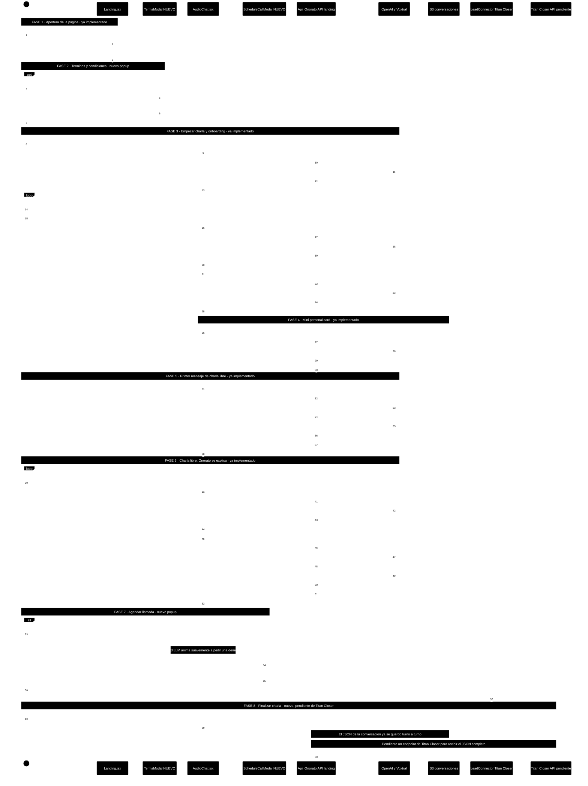

# Diagrama de secuencia — Charla completa con Onorato (landing pública)

> Este documento describe el flujo pedido (apertura de página → términos → onboarding →
> mini personal card → charla libre → agendar llamada → finalizar charla), distinguiendo
> lo que **ya existe implementado** de lo que es **nuevo** a construir.
>
> Basado en el código real de `landing_onorato/frontend/` (React) y
> `Api_Onorato/API/landing/` (Flask), y en `landing_onorato/ESQUEMA_BACKEND_LANDING_API_ONORATO.md`.

## Leyenda

| Símbolo | Significado |
|---|---|
| ✅ | Ya implementado y funcionando hoy en el repo |
| 🆕 | Nuevo — no existe todavía, hay que construirlo |
| 🕓 | Pendiente de un tercero (Titan Closer) antes de poder implementarlo |

## Decisiones tomadas (confirmadas contigo antes de este documento)

1. **Términos y condiciones**: se crea un `.json` placeholder editable (misma convención que
   `ONBOARDING_QUESTIONS`/`YOUTUBE_VIDEOS` en `config.js`, con nota "sustituir cuando lo pases"),
   y el aviso pequeño bajo "Empezar a hablar" se convierte en un enlace pulsable que abre un
   **popup nuevo** con ese texto.
2. **Titan Closer = LeadConnector**: el formulario embebido que ya existe (`LeadForm.jsx`,
   `api.leadconnectorhq.com`) **es** Titan Closer. Lo que falta es un **endpoint aparte, aún no
   proporcionado por Titan Closer**, para mandarles el JSON completo de la conversación (hoy ese
   JSON solo se guarda en S3, nunca se envía a nadie).
3. **Popup de "agendar llamada"**: hoy los botones "Agendar llamada" y "Finalizar charla" solo
   hacen scroll hasta el formulario embebido al final de la página. Se sustituye por un **popup/modal
   nuevo** que contiene el mismo formulario LeadConnector.
4. **Texto + audio**: se mantiene el comportamiento actual — el texto completo de la respuesta
   aparece en la burbuja en el mismo momento en que empieza a sonar el audio (no hay "karaoke"
   palabra por palabra; eso está documentado como mejora futura no implementada en
   `AI_CONTEXT/LATENCY_OPTIMIZATION_CHAT.md`, Grupo C).

## Nota sobre las preguntas de onboarding

El mensaje original hablaba de **3** preguntas preprogramadas. El código real
(`landing_onorato/frontend/src/config.js`) tiene hoy **4**: `name`, `city`, `caredFor` y
`caredForName` (esta última dinámica, depende de la respuesta anterior). El diagrama documenta
el comportamiento real (4, configurables en `ONBOARDING_QUESTIONS`); si quieres exactamente 3,
basta con quitar una entrada de esa lista.

---

## Diagrama de secuencia completo

Fondo negro, líneas y texto en blanco — el estado de cada fase (ya implementado / nuevo /
pendiente) queda indicado en el propio texto de cada `Note`, sin colores adicionales.

---

## Paso a paso explicado

### 1. Apertura de la página ✅
El usuario entra en la landing (`Landing.jsx`). Se genera un `session_id` único por visita
(`sessionIdRef`, formato `sess-<timestamp>-<origin>`) que viaja en todas las llamadas al backend
para poder identificar la conversación en S3. Se monta el loro 3D (o su imagen estática en
móvil), los 3 vídeos de YouTube, la cabecera con el botón "Agendar llamada" (siempre visible) y
el componente de chat (`AudioChat.jsx`) en reposo, mostrando el botón **"Empezar a hablar"** y,
debajo, en letra pequeña, el aviso legal.

### 2. Términos y condiciones 🆕
Hoy ese texto pequeño es: *"Al usar este servicio aceptas la [política de privacidad]"*, con un
enlace que abre en pestaña nueva `onoratoai.com/politica-de-privacidad`. Lo que pides es
distinto: que sea un botón pulsable que abra un **popup** con el texto de los **términos y
condiciones**, leído de un `.json` propio (no una URL externa). Se construye:
- `landing_onorato/frontend/src/terms_and_conditions.json` (🆕, placeholder editable, mismo
  patrón que las preguntas de onboarding o los vídeos en `config.js`).
- `landing_onorato/frontend/src/components/TermsModal.jsx` (🆕), un popup simple que lee ese
  JSON y lo muestra. No bloquea el inicio de la charla — es informativo, igual que el aviso
  actual.

### 3. Empezar charla + onboarding ✅
Al pulsar "Empezar a hablar" (`startChat()` en `AudioChat.jsx`), la fase pasa a `ONBOARDING`.
Onorato saluda y hace la primera pregunta: el texto se muestra en una burbuja y a la vez se
reproduce su audio (generado con `/landing/tts`, TTS de OpenAI). El usuario responde por voz:
pulsa el botón del micro para empezar a grabar (`MediaRecorder`), y pulsa el **mismo botón** otra
vez para terminar (no hay un botón separado de "grabar" y "terminar": es un único botón que
alterna entre los dos estados). Al soltar, el audio se manda a `/landing/transcribe` (STT vía
Voxtral/Nextbit256) y el texto transcrito aparece en la burbuja del usuario. Esto se repite para
cada pregunta de `ONBOARDING_QUESTIONS` (hoy 4: nombre, ciudad, a quién cuida, y el nombre de esa
persona).

### 4. Mini personal card ✅
Tras la última pregunta, el frontend llama a `/landing/build_card` con todas las respuestas. El
backend (`conversation.build_personal_card()`) usa GPT-4o-mini para resumir el onboarding en una
ficha de máximo 120 palabras (nombre, edad aproximada, aficiones, tono adecuado, etc.), sin
inventar datos. Esa ficha es la que luego personaliza toda la charla libre. En este mismo paso se
guarda el onboarding completo en S3 (`log_onboarding`).

### 5. Primer mensaje de charla libre ✅
Con la ficha ya construida, se llama a `/landing/chat` con `opening: true`. El LLM
(`opening_message()`) genera un saludo muy cálido dirigido por su nombre (sorprende gratamente a
la persona, "ya la conoce"), y en la misma respuesta el backend genera también el audio (TTS) —
todo en un único request, igual que en producción. El texto aparece en burbuja y el audio suena a
la vez.

### 6. Charla libre — Onorato se explica ✅
A partir de aquí, cada turno es: el usuario habla (micro → transcripción → texto en pantalla) y
Onorato responde (`/landing/chat` con el texto, el historial y la ficha personal). El *system
prompt* de `conversation.py` (constante `ONORATO_CAPABILITIES`) ya contiene una descripción
completa y curada de qué es Onorato y qué hace: compañía y conversación, aprendizaje de la
persona (familia, mascotas, aficiones, recuerdos, rutinas), y lo que hará el loro físico (avisos
de rutinas, medicación, citas, ejercicios mentales, detección de caídas, satélites por la casa,
videollamadas con la familia). El LLM va revelando estas capacidades **una a una**, conectándolas
con lo que la persona ya contó, en respuestas cortas (2-4 frases), sin soltar la lista de golpe.
No hay un contador fijo de "8 iteraciones": el ritmo lo marca la conversación, aunque el prompt sí
anima suavemente a pedir una demo o dejar sus datos cuando corresponde.

### 7. Agendar llamada 🆕 (popup)
Hoy, tanto el botón del header ("Agendar llamada", siempre visible) como el botón de fin de chat
llevan a un `scrollIntoView` hasta la sección `#solicitar-demo`, donde está el formulario
LeadConnector embebido (`LeadForm.jsx`). A petición tuya, esto se sustituye por un **popup/modal
nuevo** (`ScheduleCallModal.jsx`, 🆕) que contiene el mismo iframe de LeadConnector, sin tener que
bajar por la página. Este formulario **es** Titan Closer: al enviarlo, ellos ya reciben los datos
de contacto (nombre, teléfono, email) directamente en su CRM, sin pasar por `Api_Onorato`.

### 8. Finalizar charla 🆕🕓 (envío del registro completo)
El botón "Finalizar charla" hoy también hace scroll al mismo formulario. Se mantiene ese
comportamiento (abrir el popup del paso 7), pero además falta la pieza que pediste: mandar **el
registro completo de la conversación** a Titan Closer. Esa parte ya está a medio camino — el JSON
completo (`landing/conversations/{session_id}.json`, con todos los turnos de onboarding y charla
libre) se va guardando en S3 automáticamente en cada paso, vía `conversation_log.py`. Lo que
falta es el **envío**: hoy ese JSON no se manda a ningún sitio. Necesitamos que Titan Closer nos
dé un endpoint/API donde recibir ese JSON (o las credenciales de un CRM al que llamar). En cuanto
lo tengamos, se añade un paso en `Api_Onorato/API/landing/` que lea el documento de S3 y haga el
`POST` correspondiente — probablemente disparado por el propio botón "Finalizar charla" o por el
envío del formulario LeadConnector (a decidir según cómo Titan Closer quiera recibirlo).

---

## Resumen de lo que hay que construir (🆕)

| Pieza | Dónde | Qué hace |
|---|---|---|
| `terms_and_conditions.json` | `landing_onorato/frontend/src/` | Texto placeholder de términos y condiciones, editable |
| `TermsModal.jsx` | `landing_onorato/frontend/src/components/` | Popup que muestra ese JSON al pulsar el enlace de T&C |
| `ScheduleCallModal.jsx` | `landing_onorato/frontend/src/components/` | Popup con el formulario LeadConnector embebido, en vez de scroll |
| Envío a Titan Closer | `Api_Onorato/API/landing/` (nuevo módulo) | Lee `landing/conversations/{session_id}.json` de S3 y lo envía al endpoint que Titan Closer nos dé — 🕓 bloqueado hasta tener ese contrato |

## Archivos reales involucrados (ya existentes)

- Frontend: `landing_onorato/frontend/src/pages/Landing.jsx`, `components/AudioChat.jsx`,
  `components/LeadForm.jsx`, `components/LandingHeader.jsx`, `config.js`, `functions/api.js`
- Backend: `Api_Onorato/API/landing/routes.py`, `speech.py`, `conversation.py`,
  `conversation_log.py`
- Referencia previa: `landing_onorato/ESQUEMA_BACKEND_LANDING_API_ONORATO.md`,
  `AI_CONTEXT/LATENCY_OPTIMIZATION_CHAT.md`, `AI_CONTEXT/HANDOFF.md`
